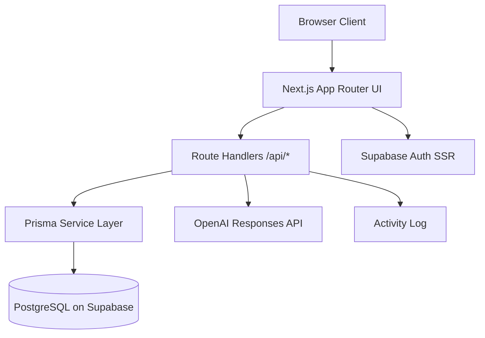

<<<<<<< HEAD
# AI Collaborative Task Platform

Production-style full-stack task management SaaS built with **Next.js App Router**, **Node.js route handlers**, **Prisma ORM**, **PostgreSQL on Supabase**, **Supabase Auth**, and **OpenAI-powered task workflows**.

This project is designed to be portfolio-ready and resume-relevant for full-stack and AI product engineering roles.

## Highlights

- **Multi-tenant architecture** with isolated workspaces
- **Role-based access control** for workspace membership
- **Prisma + PostgreSQL** relational data model with indexes
- **Supabase server-side auth** for secure session handling
- **Typed route handlers** with **Zod validation**
- **Audit trail** via activity logs
- **AI features** for task summarization and subtask generation
- **Vercel-friendly deployment**

## Tech Stack

- Next.js (App Router)
- TypeScript
- Node.js route handlers
- Prisma ORM
- PostgreSQL (Supabase)
- Supabase Auth + SSR helpers
- Zod
- OpenAI API

## Architecture



### Core Domain Model

- `User`: app-level user mapped to Supabase auth user
- `Workspace`: tenant boundary
- `WorkspaceMember`: user-role join table for RBAC
- `Project`: grouping container for tasks within a workspace
- `Task`: primary work unit with status, priority, assignee, due date
- `Comment`: task discussion thread
- `ActivityLog`: audit trail for important actions

## Folder Structure

```txt
app/
  (auth)/login
  (auth)/signup
  api/
    ai/
    auth/callback
    comments
    projects
    tasks
    workspaces
  dashboard/
components/
lib/
  ai.ts
  auth/
  db/
  http.ts
  supabase/
  validation/
prisma/
```

## Local Setup

### 1. Install dependencies

```bash
npm install
```

### 2. Configure environment variables

Copy the example env file:

```bash
cp .env.example .env
```

Fill in:

- `DATABASE_URL`
- `DIRECT_URL`
- `NEXT_PUBLIC_SUPABASE_URL`
- `NEXT_PUBLIC_SUPABASE_PUBLISHABLE_KEY`
- `SUPABASE_SERVICE_ROLE_KEY`
- `OPENAI_API_KEY`

### 3. Run database migrations

```bash
npx prisma migrate dev --name init
npx prisma generate
```

### 4. Optional seed

```bash
npm run db:seed
```

### 5. Start the app

```bash
npm run dev
```

## Supabase Setup Notes

1. Create a Supabase project.
2. Enable email/password auth.
3. Add your application URL and callback route:
   - `http://localhost:3000/api/auth/callback`
4. Use the Postgres connection string for `DATABASE_URL` and `DIRECT_URL`.

## Production Deployment

### Vercel

1. Import this repository into Vercel.
2. Add all environment variables in the Vercel project settings.
3. Ensure the production callback URL is added to Supabase auth settings.
4. Run build command:

```bash
npm run build
```

## API Overview

### `POST /api/workspaces`
Create a workspace and initial owner membership.

### `POST /api/projects`
Create a project inside an authorized workspace.

### `GET /api/tasks`
Fetch visible tasks with optional filters.

### `POST /api/tasks`
Create a task in a project you have access to.

### `PATCH /api/tasks/:taskId`
Update task fields.

### `DELETE /api/tasks/:taskId`
Delete a task.

### `POST /api/comments`
Create a task comment.

### `POST /api/ai/summarize`
Generate task summary.

### `POST /api/ai/subtasks`
Generate implementation-ready subtasks.

## Security and Production Notes

- All write endpoints require an authenticated user.
- Workspace membership is enforced before project/task/comment access.
- Inputs are validated with Zod before touching the database.
- Activity logs create an audit trail for critical actions.
- For true production hardening, add:
  - rate limiting
  - CSRF protection strategy where applicable
  - structured logging/monitoring
  - end-to-end tests
  - stronger admin/member UI flows
  - Row Level Security alignment if you expose Supabase tables directly

## Portfolio Positioning

Use this project to demonstrate:

- full-stack ownership
- multi-tenant SaaS architecture
- relational database modeling
- backend API design
- AI product integration
- deployable engineering systems

## Resume Bullets

**AI-Powered Collaborative Task Platform** | Next.js, Node.js, PostgreSQL, Prisma, Supabase, OpenAI API
- Architected and built a multi-tenant task management platform with role-based access control, supporting isolated workspaces and secure collaboration across users.
- Designed a normalized PostgreSQL schema using Prisma ORM with relational models, indexing strategies, and optimized queries to handle complex task, project, and activity data.
- Developed modular backend APIs with Next.js and Node.js, implementing validation, pagination, filtering, and state transitions for scalable task workflows.
- Integrated AI-driven task decomposition and summarization features via backend services, enabling automated conversion of unstructured input into actionable workflows.
- Implemented activity logging, performance optimizations, and production-ready deployment patterns, demonstrating end-to-end system design and engineering ownership.

## Tradeoffs

- This starter keeps the app in a single Next.js codebase to reduce deployment complexity.
- It uses route handlers instead of a separate Express service because the goal is a strong full-stack portfolio project, not microservice decomposition.
- The UI is intentionally lightweight so the architecture, data modeling, and backend decisions stay front and center.

## Next Upgrades

- real-time updates with Supabase Realtime
- invitation workflows and email onboarding
- background job queue for long-running AI workflows
- analytics dashboards
- cursor pagination across task feeds
- e2e test coverage with Playwright
=======
# taskzena-workspace
Built a modern AI-powered task management platform with workspace analytics, priority tracking, delivery insights, and executive dashboards to help teams plan, monitor, and accelerate execution.
>>>>>>> 7d94041d679738faabec0a0961690674a596359b
